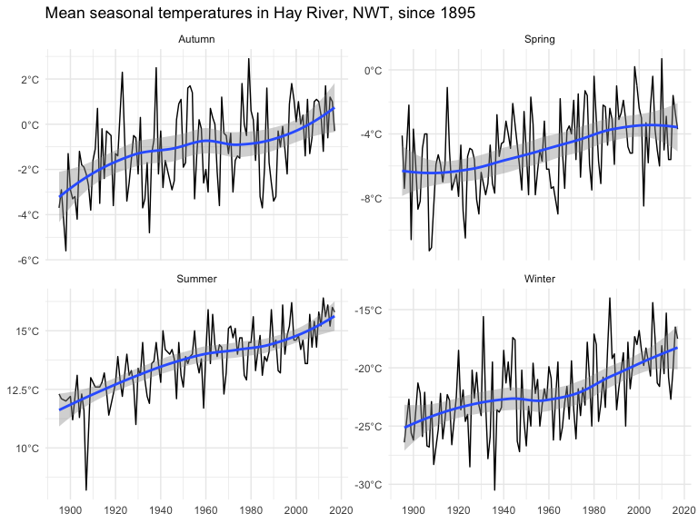

<!-- README.md is generated from README.Rmd. Please edit that file -->
cantempr
========

[](https://travis-ci.org/patrickbarks/cantempr) [](https://ci.appveyor.com/project/patrickbarks/cantempr) [](https://codecov.io/github/patrickbarks/cantempr?branch=master)

An R package to access long-term homogenized temperature data for 338 Canadian climate stations (for some stations data is available as far back as 1841). These data come from [Vincent et al. (2012)](https://doi.org/10.1029/2012JD017859), and are available in station-specific text files from [Environment and Climate Change Canada](https://www.canada.ca/en/environment-climate-change/services/climate-change/science-research-data/climate-trends-variability/adjusted-homogenized-canadian-data/surface-air-temperature-access.html) (see file 'Monthly mean of daily mean temperature').

**Data citation**: Vincent, L. A., X. L. Wang, E. J. Milewska, H. Wan, F. Yang, and V. Swail (2012) A second generation of homogenized Canadian monthly surface air temperature for climate trend analysis. Journal of Geophysical Research 117(D18110). <https://doi.org/10.1029/2012JD017859>

Installation
------------

Install from GitHub with:

``` r
# first install package 'remotes' if necessary (a dependency of devtools)
# install.packages("remotes") 
remotes::install_github("patrickbarks/cantempr")
```

Usage
-----

``` r
library(cantempr)
```

#### Fetch data

Temperature data can be fetched using the `cantemp_fetch()` function. Temperature data is available at monthly, seasonal, and annual intervals (selected with argument `interval`).

``` r
temp_annual <- cantemp_fetch(interval = "annual") # fetch annual data
```

Let's take a peek.

``` r
head(temp_annual)
#>   prov        station   stnid year interval temp flag
#> 1   BC SHAWNIGAN LAKE 1017230 1914   Annual  9.7    a
#> 2   BC SHAWNIGAN LAKE 1017230 1915   Annual  9.9    a
#> 3   BC SHAWNIGAN LAKE 1017230 1916   Annual  7.8    a
#> 4   BC SHAWNIGAN LAKE 1017230 1917   Annual  8.6    a
#> 5   BC SHAWNIGAN LAKE 1017230 1918   Annual   NA    M
#> 6   BC SHAWNIGAN LAKE 1017230 1919   Annual  8.7    a
```

We can also fetch station-specific metadata (including lat/lon/elevation, and details on the temporal extent of the temperature data) using the function `cantemp_meta()`.

``` r
stn_metadata <- cantemp_meta()
```

#### Barcode plot

The `cantempr` package includes a function to produce 'temperature barcode plots' (see examples [here](https://www.cbc.ca/news/technology/charts-climate-change-bar-codes-1.4802293)). Here's an example barcode plot using a time-series of mean annual temperatures in Toronto, Ontario.

``` r
library(ggplot2)

# subset annual temperature data to Toronto
temp_to <- subset(temp_annual, station == "TORONTO")

# create barcode plot
cantemp_barcode(temp_to, x_breaks = seq(1850, 2010, 20)) +
  ggtitle(paste("Mean annual temperatures in Toronto since", min(temp_to$year)))
```



#### Seasonal temperature trends

Here's a more traditional plot of long-term temperature trends, by season, in Hay River, Northwest Territories.

``` r
# subset to seasonal temperature data for Hay River, Northwest Territories
temp_seasonal <- cantemp_fetch(interval = "seasonal")
temp_hr <- subset(temp_seasonal, station == "HAY RIVER" & !is.na(temp))

# plot
ggplot(temp_hr, aes(year, temp)) +
  geom_line() +
  geom_smooth(method = "loess") +
  scale_x_continuous(breaks = seq(1900, 2020, 20)) +
  scale_y_continuous(labels = function(x) paste0(x, "\u00B0C")) +
  facet_wrap(~ interval, ncol = 2, scales = "free_y") +
  ggtitle(paste("Mean seasonal temperatures in Hay River, NWT, since", min(temp_hr$year))) +
  theme_minimal() + theme(axis.title = element_blank())
```


Contributions
-------------

All contributions are welcome. Please note that this project is released with a [Contributor Code of Conduct](CONDUCT.md). By participating in this project you agree to abide by its terms.
